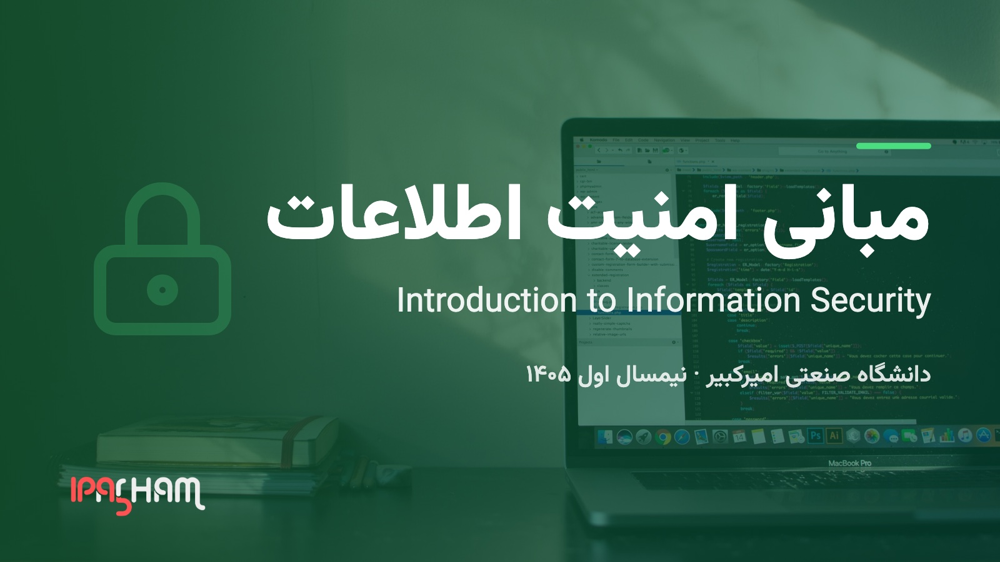

<h1 align="center"> Introduction to Information Security Lecture </h1>

<p align="center">
  
  <br />
  
  
</p>

## Introduction

A first course in information security. It starts with what the properties we
are defending actually are, gives them a standard vocabulary, builds the
cryptographic toolbox, and then spends it on real systems — access control,
hosts and malware, the web, and the network.

The material is taught from, so it is kept correct rather than kept short.
Every transcript on a hands-on slide is a real captured run, and the code on
the slides was executed before it was put there.

Prerequisites:

- Computer Networks
- Operating Systems
- Introduction to Programming

## How to Run

To run these slides locally you need [Hugo](https://gohugo.io) and [NodeJS](https://nodejs.dev/en/) installed.

```bash
npm install

hugo server
```

## Taught in

- Amirkabir University of Technology
  - Fall 2026

## Topics and Schedule

The numbers below are the lecture numbers used on the
[course homepage](https://1995parham-teaching.github.io/is-lecture/) and on the
opening slide of lecture 1.

- **1** — Introduction — concepts, security properties, threats and attacks,
  protection layers, and the course policies
- **2** — Security Architecture — X.800, enterprise architecture, security
  policy, risk management, incident response and business continuity
- **3** — Cryptography — symmetric encryption, hashes and MACs, public-key
  cryptography, digital signatures and PKI
- **4** — Access Control — the four A's, DAC/MAC/RBAC/ABAC, authentication,
  passwords, biometrics
- **5** — System & Software Security — operating system and file system
  security, malware, memory safety, host defences, virtualization
- **6** — Web Security — the web threat model, server-side and client-side
  attacks, sessions and cookies, TLS and HTTPS
- **7** — Network & Transport Security — network threats, zoning, edge security
  and firewalls, secure access and VPN, VLAN and segmentation

## Related

- [ie-lecture](https://github.com/1995parham-teaching/ie-lecture) — Internet
  Engineering. Same site machinery, and its web-security deck covers some of the
  same ground for an audience that has already met HTTP.
- [c-lecture](https://github.com/1995parham-teaching/c-lecture) — the C
  programming course, where the memory-safety material in lecture 5 comes from.
